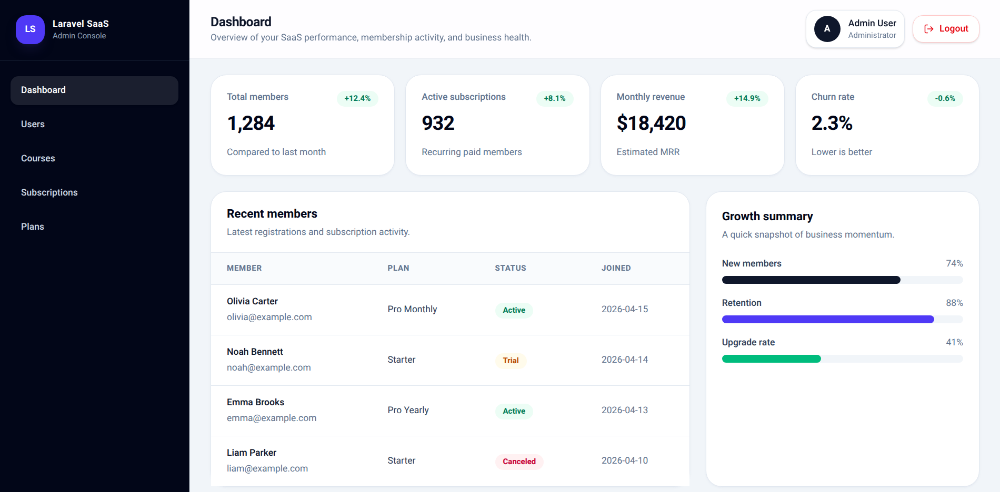
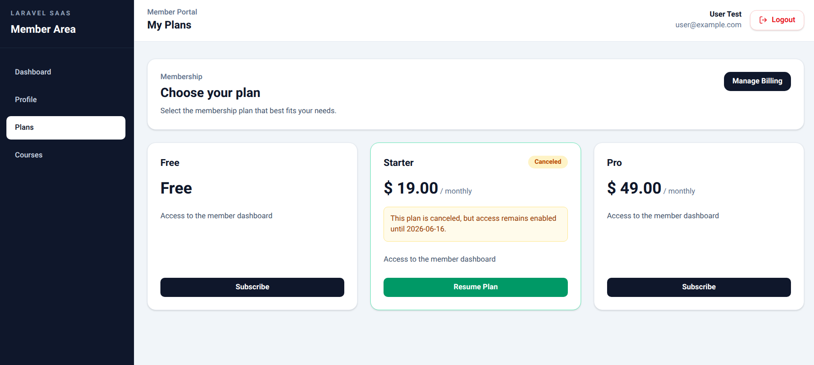
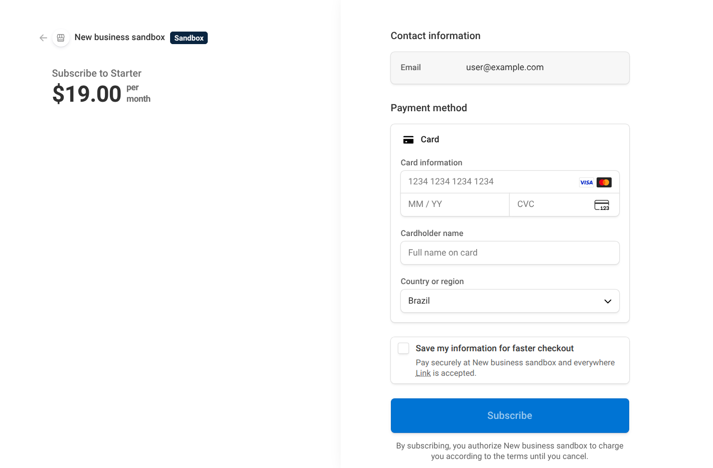
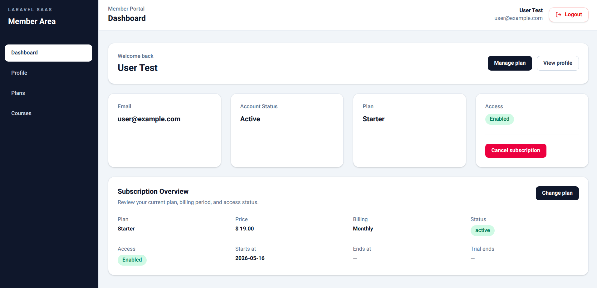
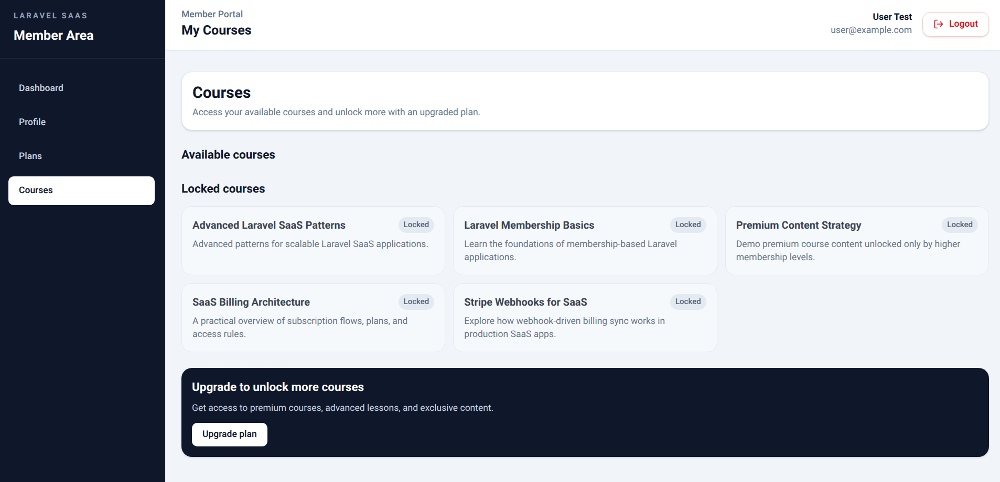

# Laravel SaaS Membership

SaaS course membership platform with subscription billing, gated content access, and admin/member areas.


---

## Project Walkthrough

[](https://youtu.be/IHXxGzwB_qM)

---

## Features

- Role-based admin/member areas
- Stripe subscription billing
- Stripe customer billing portal
- Subscription lifecycle management
- Subscription-based course access
- Responsive Vue 3 + Inertia.js frontend
- Feature tests for core SaaS flows

---

## Screenshots

### Admin Dashboard


---

### Subscription Plans & Billing



---

### Stripe Checkout Flow



---

### Member Dashboard



---

### Member Courses



---

## Technical Highlights

- Stripe subscription billing flow
- Stripe webhook synchronization
- Billing provider abstraction layer
- Role-based admin/member architecture
- Subscription lifecycle management
- Feature test coverage

---

## Project Structure

```txt
app/
├── Http/
│   ├── Controllers/
│   │   ├── Admin/
│   │   ├── Api/
│   │   └── Web/
│   ├── Middleware/
│   ├── Requests/
│   └── Resources/
├── Models/
├── Services/
│   └── Billing/
│       ├── Contracts/
│       ├── Data/
│       └── Providers/
└── Support/
    ├── Auth/
    ├── Dashboard/
    └── Web/

resources/
├── js/
│   ├── Components/
│   ├── Data/
│   ├── Layouts/
│   └── Pages/
│       ├── Admin/
│       ├── Auth/
│       └── Member/
└── views/

routes/
├── admin.php
├── api.php
└── web.php

tests/
├── Feature/
│   ├── Admin/
│   ├── Auth/
│   ├── Billing/
│   └── Member/
└── Unit/
```

---

## Local Setup

### Clone the repository

```bash
git clone https://github.com/felicianopj-dev/laravel-saas-membership
```

### Install dependencies

```bash
composer install
npm install
```

### Environment setup

```bash
cp .env.example .env
php artisan key:generate
```

Create a `.env` file:

```env
STRIPE_SECRET=sk_test_xxxxx
STRIPE_WEBHOOK_SECRET=whsec_xxxxx
STRIPE_CURRENCY=usd
STRIPE_PRICE_FREE_MONTHLY=
STRIPE_PRICE_STARTER_MONTHLY=price_xxxxx
STRIPE_PRICE_PRO_MONTHLY=price_xxxxx
STRIPE_PRODUCT_STARTER_MONTHLY=prod_xxxxx
STRIPE_PRODUCT_PRO_MONTHLY=prod_xxxxx
BILLING_DRIVER=stripe
BILLING_CURRENCY=usd
```

### Stripe Webhook Setup

Install the Stripe CLI and start webhook forwarding:

```bash
stripe listen --forward-to http://localhost:8000/api/webhooks/stripe
```

Copy the generated webhook secret into your `.env` file:

```env
STRIPE_WEBHOOK_SECRET=whsec_xxxxx
```

### Run migrations and seeders

```bash
php artisan migrate --seed
```

### Start development servers

```bash
php artisan serve
npm run dev
```

---

## Running Tests

```bash
php artisan test
```

---

## Future Improvements

- Team support
- Usage-based billing
- Email notifications
- CI/CD pipeline
- Multi-tenant architecture
- Invoice generation
- Production deployment infrastructure

---

## Connect With Me

[](https://www.linkedin.com/in/felicianopj/)
[](https://github.com/felicianopj-dev)
[](https://www.upwork.com/freelancers/~01c821de2fd9fb747b)
[](mailto:felicianopj@protonmail.com)